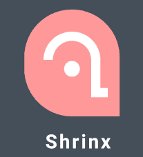

Shrix is a short-URL generator optimized for digital marketers
 
<h2>

## About
This is a work in progress short-url generator written utilizing
Node and React.

## Issues
Have a question or found a bug? Please let me know by [opening an issue](https://github.com/jodylecompte/Shrinx/issues/new).

## License
This project is licensed under the [MIT License](https://github.com/jodylecompte/Shrinx/blob/master/LICENSE)

## Code of Conduct
Please note that this project is released with a [Contributor Code of Conduct](https://github.com/jodylecompte/Shrinx/blob/master/CODE_OF_CONDUCT.md). By participating in this project you agree to abide by its terms.

## Contributing
We welcome contributions from anyone and everyone. You can get started by browing for any open and unclaimed [issues](https://github.com/jodylecompte/Shrinx/issues) or by starting a [new issue](https://github.com/jodylecompte/Shrinx/issues/new). Please create an issue before working on new functionality. Your time is valueable and appreciated and as such we don't want to waste it. 

## Contributors

Thanks goes to these wonderful people ([emoji key](https://github.com/kentcdodds/all-contributors#emoji-key)):

<!-- ALL-CONTRIBUTORS-LIST:START - Do not remove or modify this section -->
<!-- prettier-ignore -->
| [ <b>Jody LeCompte</b>](https://jodylecompte.com) [💻](https://github.com/jodylecompte/Shrinx/commits?author=jodylecompte "Code") |
| :---: |
<!-- ALL-CONTRIBUTORS-LIST:END -->

This project follows the [all-contributors](https://github.com/kentcdodds/all-contributors) specification. Contributions of any kind welcome!